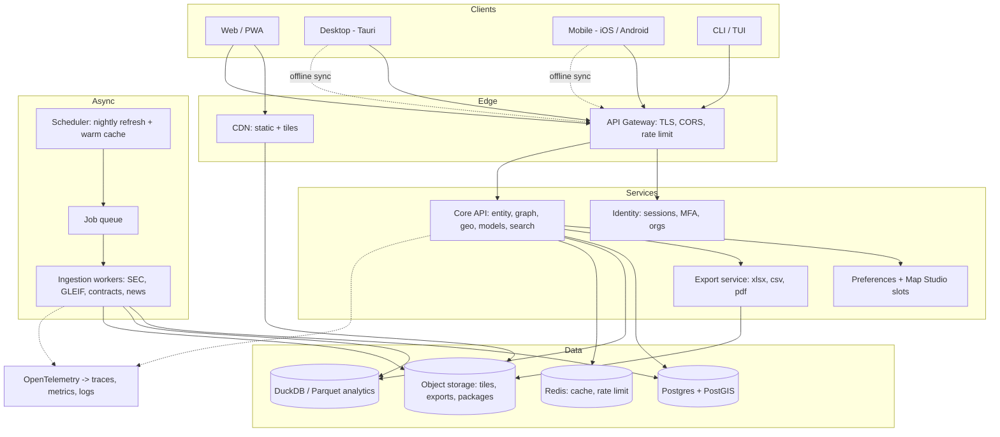

# OASIS Deployment Blueprint

**Status:** evidence-based plan. No deployment code changed.
**Verified:** 2026-07-22 against the working tree at `fc84fb2` **plus 9 uncommitted
modified files** (see §B.0 — this matters).
**Method:** every claim below was checked by running the code, not read from prior reports.

---

## A. Executive summary

OASIS is a working single-user research prototype with genuinely good bones — a
14,627-entity graph, a Parquet store, 72 API routes, a MapLibre globe with three
basemaps, real financial models, and a green test suite. It is **not deployable
today**, and the gap is not primarily features. It is that the repository contains
**zero deployment infrastructure** (no Dockerfile, no CI, no `pyproject.toml`, no
packaging of any kind — verified by direct file check) and **three measured defects
that would fail publicly on day one**.

The single most important architectural decision: **do not build for eleven
platforms.** Ship **one** well-built web application, wrap it as a PWA, and derive
desktop from the same bundle via Tauri. That covers browsers, PWA, macOS, Windows,
and Linux from one codebase. Native mobile and the CLI/TUI are separate, genuinely
justified products — but they come after the web app is real. Any plan that treats
all eleven targets as parallel workstreams will produce eleven half-products.

The second decision: **the Python backend stays.** It is the actual value (SEC XBRL
extraction, DCF/reverse-DCF, comps, the political wedge, ingestion). Rewriting it in
Node/Go to simplify packaging would discard the product to make the installer
smaller. Bundle it, don't replace it.

**Biggest risks:** (1) a user-facing endpoint that downloads 44 MB and hangs 14
seconds; (2) no auth at all, so cloud deployment currently means publishing an open
write API; (3) dataset licensing — several map/data sources are *not* redistributable,
which constrains offline packages before any code is written.

---

## B. Current-state audit (verified)

### B.0 — Uncommitted work in the tree (read this first)

```
 M data_sources.py  dcf_export.py  graph/index.html  graph/js/config.js
 M graph/js/main.js  map_api.py  political.py  store.py  test_map_intelligence_api.py
 ?? graph/Logo_Dark_BG_96.png  graph/vendor/
 → 1,742 insertions / 273 deletions (map_api.py alone +1,457)
```

A parallel session is mid-flight. **It boots (72 routes) and tests pass**, but it does
**not** fix any of the three blockers. Every recommendation here assumes this work
lands first. Phase 0 must not touch these files until they are committed.

### B.1 — Verified facts

| Claim | Verdict | Evidence |
|---|---|---|
| ~14,600 entities | ✅ **14,627** | `store.load_nodes()` |
| ~11,300 geo features | ✅ **11,338** | `companies.geojson` parse |
| Runtime readers on Parquet store | ⚠️ **Partial** | `store.py` exists and is used, but `universe.json` is **still written and still 17 MB** — prompt 10 incomplete |
| Offline bootstrap + SEC snapshot | ✅ | `bootstrap.py` present; app runs from clean checkout |
| Map Studio: Standard/Dark/Satellite | ✅ | `config.js` `BASEMAPS`, 3 entries |
| Political trades = null provider | ✅ | `political_trades_provider.py`, `NullPoliticalTradesProvider` |
| Playwright browser tests | ✅ **7 specs** | `tests/smoke.spec.js`, ~11s |
| Python tests pass | ✅ **39 passed, 1 skipped** | `pytest -q` |
| App runs from clean checkout | ✅ | boots, globe populated |

### B.2 — What does **not** exist (all verified absent)

`Dockerfile` · `docker-compose.yml` · `.github/` (no CI at all) · `pyproject.toml` ·
`setup.py` · `Makefile` · `fly.toml` · `vercel.json` · `netlify.toml` · `Procfile` ·
`.dockerignore` · **any authentication or user model** · any migration tooling · any
IaC · any observability.

`requirements.txt` exists but is incomplete: `fastapi, uvicorn, openpyxl, duckdb,
yfinance, pyyaml`. Missing at least `certifi` (imported by `cache_companyfacts.py`)
and `@playwright/test` is the only JS dep. No version lock for Python.

### B.3 — Runtime shape

- **Entry point:** `python3 map_api.py` → uvicorn on `127.0.0.1:8788`, serves both
  `/api/*` (53 routes) and the static UI via `StaticFiles`. Python **3.13.9**.
- **Frontend:** vanilla ES modules (`graph/js/{main,state,config,util}.js`), no build
  step, no bundler, no framework. MapLibre GL **vendored locally** at
  `graph/vendor/maplibre-gl/5.6.2/` (untracked — must be committed or fetched at build).
- **Stores:** Parquet (`data/store/*.parquet`, 7 files) + JSON/GeoJSON UI payloads +
  `graph/data/companyfacts/` (244 MB, unbounded) + `.env`.
- **Env vars:** `ARCGIS_LOCATION_API_KEY`, `DATA_GOV_API_KEY`, `EIA_API_KEY`,
  `TNM_ACCESS_PRODUCTS_URL`, `OASIS_RAW_DATA_ROOT`. `.env` is correctly gitignored.
- **OS assumption (breaks Windows):** `map_api.py:54`
  `RAW_DATA_ROOT = Path(os.environ.get("OASIS_RAW_DATA_ROOT", "/data/raw"))` — a POSIX
  absolute default. Must become an OS-appropriate app-data dir.
- **Auth:** none. Map Studio's 3 slots are `localStorage`, explicitly dev-only.
- **Third-party runtime hosts:** `tiles.openfreemap.org`, `basemaps.cartocdn.com`,
  `services.arcgisonline.com`, `s3.amazonaws.com` (AWS terrain), `fonts.openmaptiles.org`,
  `data.sec.gov`, `usaspending.gov`, `news.google.com`, plus a `claude.ai` deep link
  in `main.js:2139` that sends an entity name to a third party on click (privacy note).

### B.4 — Unsafe for production (measured)

1. **Synchronous SEC downloads inside request handlers.** Still live:
   `dcf_export.py:103` and `:117` call `cache_one(cik)` → `urlopen(timeout=30)`.
   Measured: **14.3 s**, **18 files downloaded**, **+44 MB disk**, **1 usable peer**
   from one cold `GET /api/entity/CAT/comps`. Worst case 18×30 s = 9 min.
2. **Export network dependency.** `dcf_export.py:193` `urlretrieve` fetches a Clearbit
   logo during `.xlsx` export, **guessing `{ticker}.com`** when unknown.
3. **Basemap preference destroyed on CDN failure.** `main.js:1232` sets
   `productPrefs.basemap="standard"` and persists it inside a catch. Reproduced 4/4.
4. **Eager universe load.** Runtime-verified: `/api/universe/bulk` = **6.11 MB decoded**
   parsed at first paint, `bulkLoaded: true`, 14,627 nodes. `loadBulk()` is lazy by
   design but called unconditionally at startup (`main.js:2142`, `:2846`).
5. **Unbounded disk.** `companyfacts/` at 244 MB with no cap; full warm ≈ 40+ GB. This
   box already hit ENOSPC once.
6. **No auth.** `POST /api/overrides`, `DELETE`, report generation are unauthenticated.
   Safe on localhost; publishing as-is means an open write API.

---

## C. Platform support matrix

| Platform | Min version | Arch | Format | Offline | Shared code | Platform-specific | Updates | Signing | Store |
|---|---|---|---|---|---|---|---|---|---|
| Web | Evergreen (last 2) | — | HTTPS | No | 100% | none | Deploy | TLS only | — |
| PWA | Chrome 90+/Safari 16.4+ | — | Installable | Partial | ~98% | SW + manifest | SW update | TLS | — |
| macOS | 12 Monterey | x64 + arm64 (universal) | `.dmg` | Yes | ~90% | Tauri shell | Tauri updater | Dev ID + **notarization** | Direct (MAS later) |
| Windows | 10 1809+ | x64 (arm64 later) | `.msi` | Yes | ~90% | Tauri shell | Tauri updater | Authenticode (EV → SmartScreen) | Direct/winget |
| Linux | Ubuntu 22.04+ | x64 (arm64 later) | AppImage + `.deb` | Yes | ~90% | Tauri shell | AppImage/apt | GPG | apt/Flathub later |
| iOS | 16 | arm64 | `.ipa` | Partial | ~60% | Swift shell + MapLibre iOS | App Store | Apple Dev | **App Store** |
| Android | 10 (API 29) | arm64 + x64 | `.aab` | Partial | ~60% | Kotlin shell + MapLibre Android | Play | Play signing | **Play** |
| CLI | Python 3.11+ | any | `pipx`/PyPI/brew | Yes | ~70% (core) | argparse layer | `pipx upgrade` | PyPI attest | PyPI/brew |
| TUI | Python 3.11+ | any | same as CLI | Yes | ~70% | Textual views | same | same | same |
| Docker/self-host | — | amd64+arm64 | OCI image | Yes | 100% | compose | image tag | cosign | GHCR |

**Deliberately excluded from v1:** Windows ARM, Linux ARM, Mac App Store, Snap. Add
only on demand — each is a signing/CI cost with near-zero initial users.

---

## D. Target architecture



**Boundary rule that fixes blocker #1:** workers are the *only* component permitted to
make outbound third-party calls. The API layer reads local stores exclusively. This is
architectural, not a patch — enforce it in review.

---

## E. Repository architecture

**Recommendation: stay a monorepo.** One maintainer, shared domain models, coupled
releases. Multi-repo would add cross-repo version coordination for zero benefit at
this stage. Revisit only if mobile gets a dedicated team.

```
oasis/
  core/                  # importable package (was: loose root scripts)
    domain/              # entity, security, listing, facility, politician
    store/               # store.py, parquet/duckdb readers
    models/              # dcf, reverse_dcf, comps, gates
    ingest/              # refresh_*.py, providers/ (SEC, GLEIF, Quiver)
    export/              # dcf_export (network-free)
  api/
    main.py              # app factory
    routers/             # entity, map, assets, political, events, reliefs, reports
    middleware/          # auth, rate limit, CORS, request id
  workers/               # queue consumers, scheduler, cache warming
  web/
    src/{state,config,views/{globe,network,panel},studio}.js
    vendor/              # maplibre (committed or build-fetched)
    public/              # manifest.json, sw.js, icons
  clients/
    desktop/             # Tauri (src-tauri/, sidecar python)
    mobile/              # ios/ android/ (phase 4)
    cli/                 # oasis CLI + TUI
  deploy/
    docker/ compose/ terraform/ k8s/
  tests/                 # pytest/ playwright/ load/
  data/                  # gitignored artifacts
  docs/
```

Migration is **incremental**: create `core/`, move one module per PR with tests green.
Do not attempt a big-bang restructure — the in-flight `map_api.py` work would conflict
catastrophically.

---

## F. Deployment topologies

**1. Low-cost early stage (recommended to start, ~$25–50/mo)**

```
Cloudflare (DNS/CDN/WAF, free)
   └── Hetzner CX22 or Fly.io machine
         docker compose: caddy(TLS) → api(uvicorn) → worker → postgres+postgis → redis
         volume: parquet + tiles + companyfacts (capped)
   └── Cloudflare R2 (exports, dataset packages — zero egress fees)
```

**2. Production scalable**

```
Cloudflare CDN/WAF
  → Load balancer
     → API (2–4 stateless containers, autoscale on p95)
     → Workers (separate pool, queue-driven)
  → Managed Postgres+PostGIS (HA, PITR backups)
  → Redis (cache, rate limit, queue)
  → S3/R2 (tiles, exports, packages, backups)
  → OpenTelemetry collector → Grafana Cloud
Blue-green via container tags; PR preview envs on Fly.
```

**3. Local/offline** — Tauri app: bundled Python sidecar on `127.0.0.1:<random>`,
DuckDB+Parquet on disk, PMTiles basemap, no network required.

**4. Enterprise self-hosted** — single `docker compose` or Helm chart, air-gap mode
(no outbound), SSO via OIDC, dataset packages delivered as signed archives, audit log
to the customer's SIEM.

**Provider recommendation:** **Cloudflare + Hetzner** early (predictable cost, R2 has
no egress fees which matters enormously for tile serving), migrating compute to **Fly.io
or AWS ECS** at scale. Avoid Vercel/Netlify as primary — they are optimized for
JS/serverless, and OASIS is a long-running Python process with background workers and
large local data; you would fight the platform. Avoid Lambda for the API for the same
reason (cold starts + 15-min ceiling + no local Parquet affinity).

---

## G. CI/CD matrix (GitHub Actions — none exists today)

| Workflow | Trigger | Jobs |
|---|---|---|
| `ci.yml` | PR | ruff, mypy (advisory), pytest (3.11/3.12/3.13), Playwright (chromium+firefox+webkit), `pip-audit`, `npm audit` |
| `data.yml` | nightly | `bootstrap.py`, schema validation, dataset-compat check, publish manifest |
| `web.yml` | main | build → image (amd64+arm64) → GHCR → staging → smoke → prod (manual gate) |
| `desktop.yml` | tag | matrix: macos-14(arm64), macos-13(x64), windows-latest, ubuntu-22.04 → Tauri → sign/notarize → release |
| `mobile.yml` | tag | macos runner → iOS archive → TestFlight; ubuntu → AAB → Play internal |
| `cli.yml` | tag | build sdist/wheel → PyPI (trusted publishing) → Homebrew tap PR |
| `security.yml` | weekly | CodeQL, Trivy image scan, SBOM (Syft) → attach to release, cosign sign |

**Versioning:** SemVer for clients; `/api/v1` URL-versioned API (never break v1 without
a v2); `DATA_SCHEMA_VERSION` integer for Parquet schema; date-versioned dataset packages
(`2026-07-22`); model versions pinned in output (`model_version` in every result) so a
report is reproducible.

---

## H. Implementation roadmap (dependency order, no calendar estimates)

**Phase 0 — Stabilization** (prereq: in-flight work committed). Complexity: M.
Remove network from request paths; fix basemap preference; lazy bulk; bound
companyfacts cache; cross-platform data dir; deterministic failure tests.
*Exit:* cold comps < 500 ms and 0 downloads; first paint < 400 KB; offline start clean;
Playwright green on 3 engines. *Rollback:* revert commit; no infra involved.

**Phase 1 — Production web.** Complexity: L. Prereq: Phase 0.
`pyproject.toml` + lockfile; Dockerfile (multi-stage, non-root); compose; CI; auth
(sessions + argon2, MFA later); Postgres for users/prefs only (keep Parquet for
analytics); security headers/CSP/CORS allowlist; rate limiting; OTel; staging → beta.
*Exit:* staging = prod parity, auth tested, backups restore-verified, p95 < 300 ms.
*Rollback:* previous image tag; DB migrations must be backward-compatible one release.

**Phase 2 — PWA + offline.** Complexity: M. Manifest, SW (app shell + tiles), IndexedDB,
signed dataset packages with delta updates + resume + quota. *Exit:* installs on
Android/iOS, works airplane-mode, never auto-downloads > 50 MB without consent.

**Phase 3 — Desktop (Tauri).** Complexity: L. Python sidecar (PyInstaller), local
service lifecycle, updater + rollback, signing/notarization on all three OSes.
*Exit:* signed installers, clean install/upgrade/uninstall on fresh VMs.

**Phase 4 — Mobile.** Complexity: XL. Native shells + MapLibre native, reduced-density
data, cellular guards, store submissions. *Exit:* TestFlight/Play internal accepted.

**Phase 5 — CLI/TUI + enterprise.** Complexity: L. Typer+Rich CLI, Textual TUI, PyPI/brew,
SSO, org workspaces, audit logs, Helm chart.

---

## I. Risk register

| Risk | Sev | Prob | Mitigation |
|---|---|---|---|
| SEC throttle/ban from request-path fetches | **Critical** | **High** | Phase 0 §1 — workers only, ≤8 req/s, backoff+jitter |
| Disk exhaustion (40+ GB warm) | **Critical** | **High** | Hard cache cap + LRU eviction + quota alerts |
| Open write API if deployed without auth | **Critical** | Med | Auth is a Phase-1 gate, not optional |
| Dataset licensing violation in offline packages | **High** | Med | §J audit before any bundling; default deny |
| Basemap CDN outage degrades UX + eats prefs | High | Med | Phase 0 §2 + bundled PMTiles fallback |
| Mobile memory with 14.6k entities | High | High | Server-side viewport queries; never ship full universe |
| Apple notarization / SmartScreen friction | Med | High | Budget EV cert; start signing in Phase 3 CI early |
| App Store rejection (financial data) | Med | Med | Clear disclaimers, no advice framing, privacy labels |
| In-flight `map_api.py` conflicts with modularization | High | **High** | Commit first; modularize by extraction, never rewrite |
| Observability cost overrun | Med | Med | OTel-first, self-host Grafana; avoid per-host APM pricing |
| Offline sync conflicts | Med | Med | Last-write-wins + version vector on slots only |

---

## J. Data licensing (audit before bundling — **default deny**)

| Source | Class | Redistribute? | Notes |
|---|---|---|---|
| SEC EDGAR / XBRL | Public domain | ✅ Yes | Attribution + UA required; rate limits apply |
| USAspending | Public domain | ✅ Yes | US Gov work |
| GLEIF LEI | CC0 | ✅ Yes | Attribution appreciated |
| congress-legislators | Public domain | ✅ Yes | |
| USGS 3DEP terrain | Public domain | ✅ Yes | Local tiles deleted; AOI rebuild available |
| AWS Terrain Tiles (Tilezen) | Open (mixed src) | ✅ Cache | Attribution: Tilezen/USGS/SRTM/GMTED |
| OpenFreeMap / OSM | ODbL | ⚠️ Share-alike | Attribution mandatory; ODbL obligations if derived |
| CARTO dark-matter style | Style: BSD-ish; tiles: CARTO ToS | ⚠️ **API-only** | **Do not bundle tiles**; style JSON reusable |
| **Esri World Imagery** | **Esri ToS** | ❌ **No** | Free tier is *not* redistributable; commercial use needs a license — **resolve before launch** |
| Google News RSS | Google ToS | ❌ No | Link + headline only; never cache full text |
| yfinance / Yahoo | Yahoo ToS | ❌ No | Personal use only — **replace before commercial launch** |
| QuiverQuant | Commercial | ❌ No | Paid; per-seat terms |
| Company logos (Clearbit) | Vendor ToS | ❌ No | Remove guessed-domain fetch entirely |

**Two items block commercial launch and need a decision now:** Esri satellite imagery
and yfinance pricing. Alternatives: Sentinel-2 (open) or a paid imagery license;
Nasdaq/Polygon/Tiingo for prices.

---

## K. Decision log

| Decision | Chosen | Alternatives | Rationale | Revisit if |
|---|---|---|---|---|
| Platform strategy | Web-first → PWA → Tauri desktop | 11 parallel targets | One codebase covers 5 platforms | Mobile becomes primary demand |
| Desktop shell | **Tauri** | Electron, native | ~10 MB vs ~150 MB; system WebView; Rust sidecar mgmt | WebView2/WKWebView MapLibre bugs prove blocking |
| Mobile | **Native + MapLibre native** (Phase 4) | RN, Flutter, Capacitor | Map perf + memory with large datasets is the whole product | A thin PWA proves sufficient |
| Backend language | **Keep Python** | Rewrite Node/Go | The models/ingestion *are* the product | Packaging becomes untenable |
| Primary DB | **Postgres+PostGIS** (users/prefs/geo) + **DuckDB/Parquet** (analytics) | All-Postgres, all-DuckDB | DuckDB is superb single-node analytics but has no concurrent multi-user story | Multi-tenant write load grows |
| Search | **Postgres FTS** first | Elasticsearch | 14.6k entities does not justify a search cluster | > 1M docs or fuzzy/semantic needs |
| Queue | **Redis + RQ** | Celery, Temporal, Kafka | Smallest thing that runs bounded ingestion | Multi-step workflows need durability |
| Hosting | **Cloudflare + Hetzner** → Fly/AWS | Vercel, Netlify, Lambda | Long-running Python + workers + big local data; R2 zero egress | Enterprise procurement demands AWS/Azure |
| Observability | **OpenTelemetry-first** | Datadog, Dynatrace | Vendor-neutral; per-host APM costs dominate early | Enterprise SLAs require vendor support |
| Monorepo | **Yes** | Multi-repo | Single maintainer, shared models | Dedicated mobile team appears |
| E2E tool | **Playwright only** | Cypress, both | Already working; 3 engines incl. WebKit; Cypress adds no unique value | — |

---

## L. Tooling workflows (avoid overlap)

- **Playwright** — the E2E + regression tool. Also the right place for deterministic
  failure injection (`page.route(...).abort()`) — already used for the basemap test.
  **Do not add Cypress**: no WebKit, no unique capability here.
- **Browser Performance API** — cold/warm transfer, DCL, resource waterfall. Zero setup;
  this is what produced the 6.11 MB finding. Primary frontend perf tool.
- **Proxyman / mitmproxy** — *unique value:* intercepting the **Python ingestion**
  scripts' outbound HTTPS (SEC/GLEIF), which the browser tools cannot see. Use
  `mitmproxy` in CI (scriptable, headless); Proxyman for interactive macOS debugging.
  Pick one per context, not both.
- **k6** — API load/soak (p95/p99, queue depth under load). Prefer over Locust for
  scriptable thresholds in CI.
- **Lighthouse CI** — PWA/perf budget gate in CI.
- **OpenTelemetry** — production traces/metrics/logs, one pipeline for API + workers.
- **Skip for now:** Fiddler, TCPView, Requestly (overlap with the above), Datadog and
  Dynatrace (cost before need — keep OTel migration path open).

---

## M. Performance budgets (CI-enforced)

| Surface | Budget |
|---|---|
| Web first paint transfer | **< 400 KB** (today: bulk alone is 6.11 MB decoded) |
| Web warm load | < 200 ms DCL (today: 110 ms ✅) |
| No full-universe payload at paint | `graphState().bulkLoaded === false` |
| API cached read | < 100 ms p95 |
| API cold user request | **< 500 ms** (today comps: 14,300 ms ❌) |
| Request-path external downloads | **0, enforced by test** |
| companyfacts cache | hard cap (2 GB), LRU eviction |
| Desktop installer | < 40 MB; idle RSS < 400 MB |
| Mobile cold start | < 3 s; memory < 350 MB |
| CLI `--help` | < 200 ms |

---

## N. Phase 0 execution prompt

See **`Prompts/19-phase0-launch-safety.md`** — written to be handed directly to a
coding agent, with git-safety rules protecting the in-flight work.
