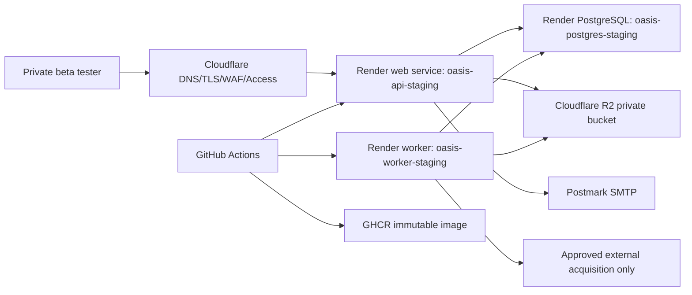

# Public Staging Architecture

## Boundaries

- Internet traffic reaches OASIS only through Cloudflare Access and HTTPS.
- OASIS authentication still runs inside the outer Access boundary.
- The API and worker use the same image but different service commands.
- The API does not run dataset acquisition; the worker owns bounded external
  refresh jobs.
- PostgreSQL is private to provider networking.
- Object storage is private by default and accessed server-side.

## Provider Decision

Render was chosen for the first public staging target because it keeps the
existing Docker image, separate worker, managed PostgreSQL, secrets, health
checks, logs, rollbacks, and image-backed deploys with low operational burden.

Cloudflare is used where it is strongest: DNS, Access, edge controls, and R2
S3-compatible object storage.

Rejected alternatives are recorded in ADR-0008.

## Scaling Constraint

Phase 1.75 staging runs one API replica. Existing in-process rate limiting is
acceptable only behind Cloudflare Access/WAF for a controlled private beta.
Multiple API replicas require a shared rate-limit store before approval.
